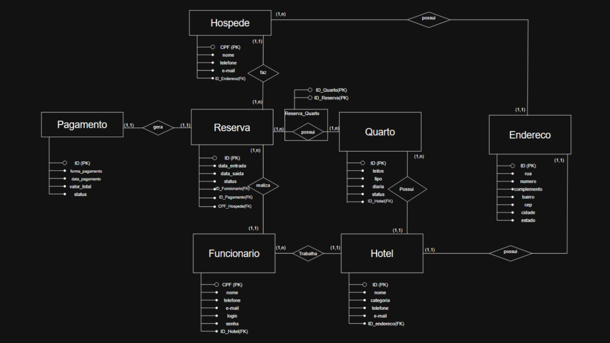

# Projeto-SQL-Faculdade
Projeto SQL da faculdade, com consulta feita no SQL Server e no MySQL

# Etapas do trabalho:
## Primeira Etapa - Modelagem.
Tive que fazer um MER (Modelo Entidade-Relacionamento) com base nas seguintes regras de negocio.
<ul>
  <li>Funcionário – Deverão ser armazenados os seguintes dados: CPF, nome, telefone, e-mail, login e senha; </li>
  <li>Hotel – Deverão ser armazenados os seguintes dados: identificação do hotel, nome, categoria, telefone, e-mail e endereço, sendo o endereço composto por rua, número, complemento, bairro, CEP, cidade e estado  </li>
  <li>Quarto – Deverão ser armazenados os seguintes dados: identificação do quarto, número de leitos, tipo (standard, luxo ou suíte), preço da diária e status (disponível, ocupado ou manutenção)</li>
  <li>Hóspede – Deverão ser armazenados os seguintes dados: CPF, nome, telefone, e-mail e endereço, sendo o endereço composto por rua, número, complemento, bairro, CEP, cidade e estado </li>
  <li>Reserva – Deverão ser armazenados os seguintes dados: identificação da reserva, data de entrada, data de saída e status (ativa, cancelada ou concluída) </li>
  <li>Pagamento – Deverão ser armazenados os seguintes dados: identificação do pagamento, forma de pagamento (cartão, pix ou dinheiro), data do pagamento, valor total e status (pago ou pendente)  </li>
  <li>Um hotel possui um ou vários quartos</li>
  <li>Um ou vários funcionários trabalham em um hotel </li>
  <li>Um funcionário realiza uma ou várias reservas</li>
  <li>Um ou vários quartos fazem parte de uma ou várias reservas</li>
  <li>Um hóspede pode fazer uma ou várias reservas</li>
  <li>Uma reserva gera um pagamento </li>
</ul>



## Segunda Etapa - Implementação.
Tive que fazer a implementação de um banco de dados seguindo a seguintes regras de negocio.
<br>

<br>
Fiz a implementação em dois bancos de dados diferentes no SQL Server e no MySQL.

### SQL Server

``` sql
CREATE DATABASE LocadoraVeiculos;

USE LocadoraVeiculos;

CREATE TABLE Cliente (
	idCliente INTEGER IDENTITY(1,1) PRIMARY KEY ,
	CPF VARCHAR(20) NOT NULL,
	nome VARCHAR(50) NOT NULL,
	telefone VARCHAR(20) NOT NULL,
	email VARCHAR(50) NOT NULL,
	endereco VARCHAR(100) NOT NULL
);

CREATE TABLE Pagamento(
	idPagamento INTEGER IDENTITY(1,1) PRIMARY KEY NOT NULL,
	forma VARCHAR(20) NOT NULL CHECK (forma IN('Cartão','Pix','Dinheiro')),
	dataPagamento DATE NOT NULL,
	valorTotal DECIMAL (7,2) NOT NULL,
	estado VARCHAR(20) NOT NULL CHECK(estado IN('Pago','Pendente'))

);

CREATE TABLE Locacao(
	idLocacao INTEGER IDENTITY(1,1) PRIMARY KEY NOT NULL,
	idCliente INTEGER NOT NULL,
	idPagamento INTEGER NOT NULL,
	dataInicio DATE NOT NULL,
	dataFim DATE NOT NULL,

	FOREIGN KEY (idCliente) REFERENCES Cliente(idCliente),
	FOREIGN KEY (idPagamento) REFERENCES Pagamento(idPagamento)

);

CREATE TABLE Veiculo(
	idVeiculo INTEGER IDENTITY(1,1) PRIMARY KEY NOT NULL,
	modelo VARCHAR (50) NOT NULL,
	marca VARCHAR (50) NOT NULL,
	ano INT NOT NULL,
	placa VARCHAR (10),
	valorDiaria DECIMAL(7,2),

	estado VARCHAR (20) NOT NULL CHECK(Estado in('Disponível','Alugado','Manutenção'))

);

CREATE TABLE Manutencao(
	idManutencao INTEGER IDENTITY(1,1) PRIMARY KEY NOT NULL,
	idVeiculo INTEGER NOT NULL,
	descricao VARCHAR(100) NOT NULL,
	dataManutencao DATE NOT NULL,
	custo DECIMAL(7,2) NOT NULL

	FOREIGN KEY (idVeiculo) REFERENCES Veiculo(idVeiculo)

);

CREATE TABLE LocacaoVeiculo(
	idLocacao INTEGER NOT NULL,
	idVeiculo INTEGER NOT NULL,

	PRIMARY KEY (idLocacao, idVeiculo),

	FOREIGN KEY (idLocacao) REFERENCES Locacao(idLocacao),
	FOREIGN KEY (idVeiculo) REFERENCES Veiculo(idVeiculo)

);

```

### MySQL
``` sql
CREATE DATABASE LocadoraVeiculos;

USE LocadoraVeiculos;

CREATE TABLE Cliente (

	idCliente INT AUTO_INCREMENT PRIMARY KEY,
	CPF VARCHAR(20) NOT NULL,
	nome VARCHAR(50) NOT NULL,
	telefone VARCHAR(20) NOT NULL,
	email VARCHAR(50) NOT NULL,
	endereco VARCHAR(100) NOT NULL

);


CREATE TABLE Pagamento (

	idPagamento INT AUTO_INCREMENT PRIMARY KEY,
	forma ENUM('Cartão','Pix','Dinheiro') NOT NULL,
	dataPagamento DATE NOT NULL,
	valorTotal DECIMAL(7,2) NOT NULL,
	estado ENUM('Pago','Pendente') NOT NULL

);


CREATE TABLE Locacao (

	idLocacao INT AUTO_INCREMENT PRIMARY KEY,
	idCliente INT NOT NULL,
	idPagamento INT NOT NULL,
	dataInicio DATE NOT NULL,
	dataFim DATE NOT NULL,

	FOREIGN KEY (idCliente) REFERENCES Cliente(idCliente),
	FOREIGN KEY (idPagamento) REFERENCES Pagamento(idPagamento)

);


CREATE TABLE Veiculo (

	idVeiculo INT AUTO_INCREMENT PRIMARY KEY,
	modelo VARCHAR(50) NOT NULL,
	marca VARCHAR(50) NOT NULL,
	ano INT NOT NULL,
	placa VARCHAR(10) NOT NULL,
	valorDiaria DECIMAL(7,2) NOT NULL,
	estado ENUM('Disponível','Alugado','Manutenção') NOT NULL

);


CREATE TABLE Manutencao (

	idManutencao INT AUTO_INCREMENT PRIMARY KEY,
	idVeiculo INT NOT NULL,
	descricao VARCHAR(100) NOT NULL,
	dataManutencao DATE NOT NULL,
	custo DECIMAL(7,2) NOT NULL,

	FOREIGN KEY (idVeiculo) REFERENCES Veiculo(idVeiculo)

);


CREATE TABLE LocacaoVeiculo (

	idLocacao INT NOT NULL,
	idVeiculo INT NOT NULL,

	PRIMARY KEY (idLocacao, idVeiculo),

	FOREIGN KEY (idLocacao) REFERENCES Locacao(idLocacao),
	FOREIGN KEY (idVeiculo) REFERENCES Veiculo(idVeiculo)

);

```

## Etapa três - Consultas.
E por ultimo tive que fazer consultas no banco que implementei, seguindo as seguintes instruções.

### Implemente uma consulta para listar a descrição, a data e o custo de todas as manutenções realizadas nos veículos. 
``` sql
SELECT descricao,dataManutencao,custo FROM Manutencao;
```
### Implemente uma consulta para listar o valor total arrecadado pela locadora. Lembre-se que pagamentos “pendentes” não fazem parte da soma.  
``` sql
SELECT SUM(valorTotal) from Pagamento
WHERE estado = 'Pago';
```
### Implemente uma consulta para listar o modelo e a marca dos veículos, bem como o número de vezes que cada um foi locado. A listagem deve ser mostrada em ordem decrescente pelo número de aluguéis. 
``` sql
SELECT COUNT(v.idVeiculo) AS quantidade_locacoes ,v.marca,v.modelo FROM LocacaoVeiculo lv
INNER JOIN Veiculo v
	ON lv.idVeiculo = v.idVeiculo
INNER JOIN Locacao l
	ON lv.idLocacao = l.idLocacao

GROUP BY v.idVeiculo, v.marca, v.modelo
ORDER BY quantidade_locacoes DESC;
```
### Implemente uma consulta para listar o nome dos clientes que possuem pagamento “pendente”, bem como o valor devido por eles. A listagem deve ser mostrada em ordem alfabética crescente pelo nome dos clientes.  
``` sql
SELECT c.nome,p.estado,p.valorTotal FROM Locacao l
INNER JOIN Cliente c
	ON l.idCliente = c.idCliente
INNER JOIN Pagamento p
	ON l.idPagamento = p.idPagamento

WHERE p.estado = 'Pendente'
ORDER BY c.nome ;
```
